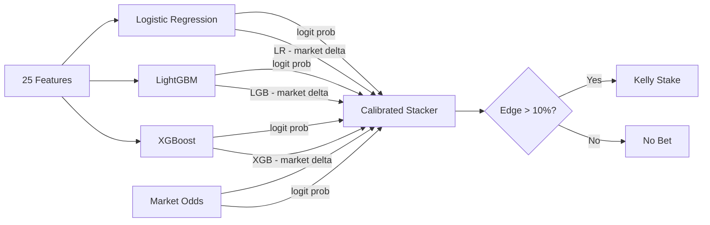
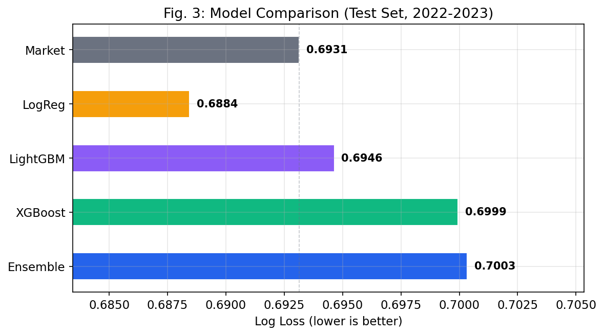
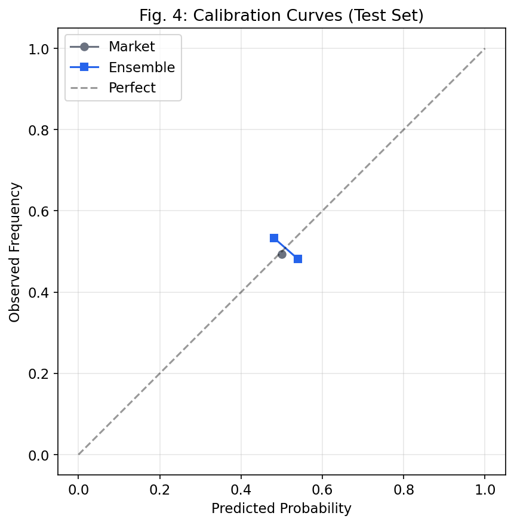
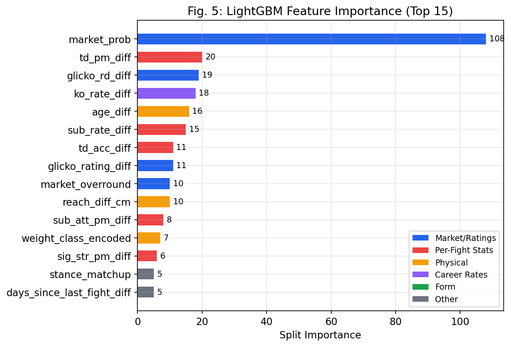
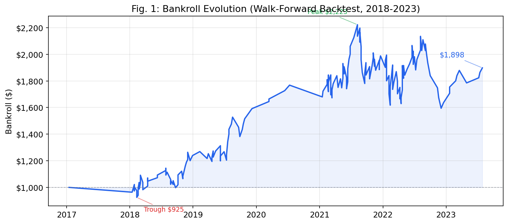
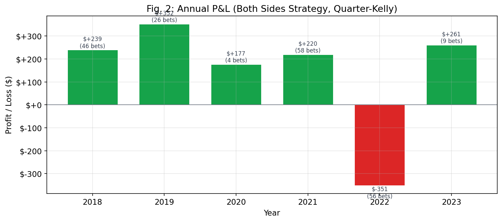
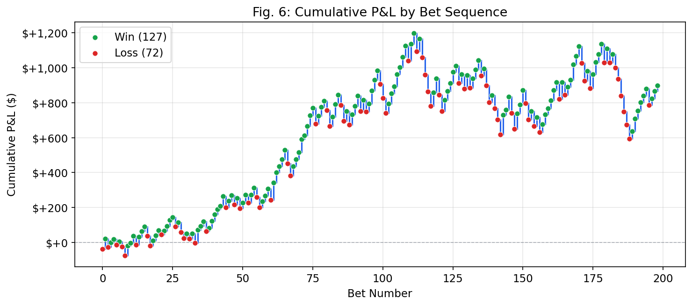
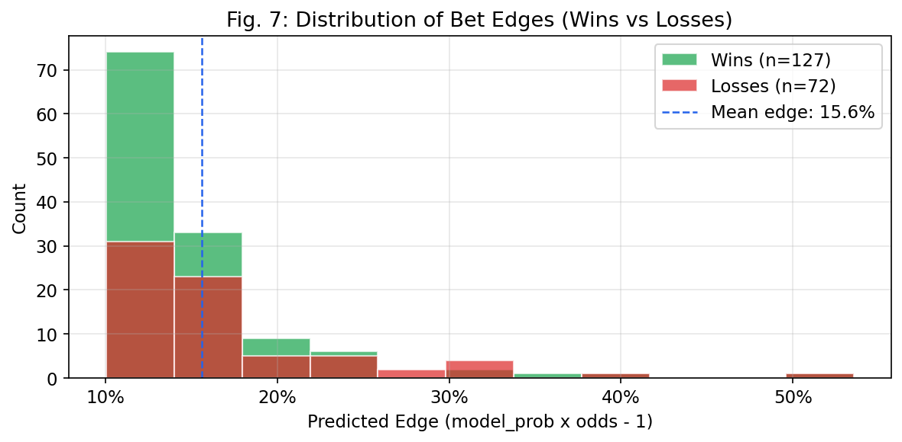
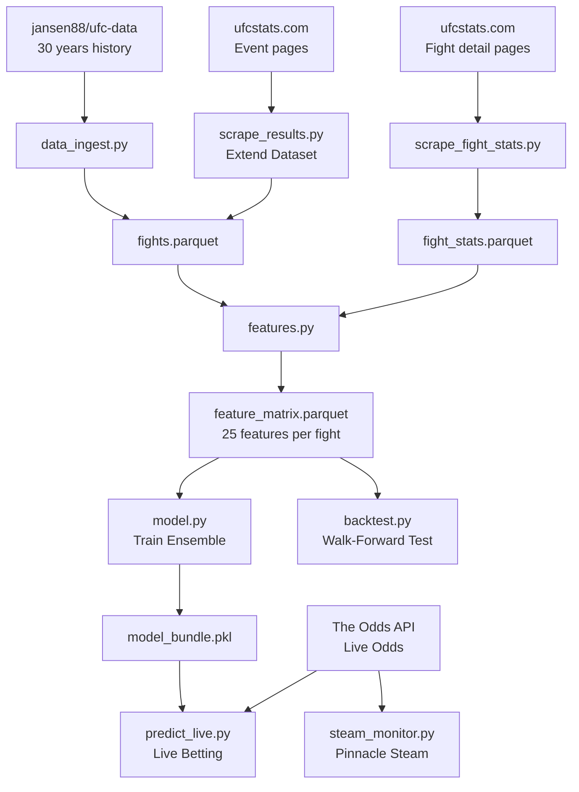

# Can Machine Learning Beat UFC Betting Markets?

**An early-stage experiment -- ported from [afl-betting](https://github.com/plwp/afl-betting).**

## Abstract

We built an ensemble machine learning system to identify value bets in UFC/MMA head-to-head markets. The system combines individual Glicko-2 ratings, Elo ratings, per-fight rolling statistics scraped from ufcstats.com, physical attributes, and bookmaker odds via a calibrated logit-space stacker. Over a 6-year walk-forward backtest (2018-2023), the strategy produced +6.4% ROI on 199 bets with a 63.8% win rate, growing a $1,000 bankroll to $1,898. Unlike the AFL version, individual fighter sports offer more data (500+ fights/year vs 200 matches/year) but higher variance (one-punch KOs) and a different market structure (name recognition bias, casual money).

The system also includes a Pinnacle steam monitor for detecting sharp line movements before AU books adjust.

## 1. Introduction

MMA betting markets are less efficient than major team sports: name recognition drives casual money, fighter-level variance is extreme, and the sheer number of statistical dimensions (striking, grappling, cardio, weight cuts) creates more room for model-based edge. The question is whether a quantitative system, trained on 30 years of UFC history and enriched with per-fight statistics, can exploit these inefficiencies.

**Preliminary answer: cautiously yes.** The walk-forward backtest shows consistent profitability across 5 of 6 test years, but the system is young and the edge is thin. This document reports the methodology, results, and known limitations.

## 2. Data

**Coverage**: 30 years of UFC history (1994-2026), ~8,400 fights. Historical odds available for ~3,400 fights (2013+).

| Source | Data | Usage |
|--------|------|-------|
| jansen88/ufc-data (GitHub) | Fight results, physical stats, odds | Core dataset (30 years) |
| ufcstats.com | Per-fight round-by-round statistics | Point-in-time rolling averages |
| ufcstats.com (event pages) | Recent fight results (Oct 2023+) | Dataset extension |
| The Odds API | Live odds from 8+ AU/US bookmakers | Live scanning, steam detection |
| BestFightOdds | Historical odds from 12+ bookmakers | Not yet integrated (JS rendering) |

**Important caveat on odds**: The jansen88 dataset includes historical odds sourced from betmma.tips. These are closing odds from a single source, which may not reflect best-available prices. This is less flattering than the AFL project's AuSportsBetting data (which reports best-available across bookmakers).

**Data leakage fixes**: Two sources of leakage were discovered and fixed during development:
1. **Win streak computation** used the current fight's outcome to determine streak direction. Fixed to compute from history only.
2. **Career statistics** from ufcstats.com are static snapshots (scraped at collection time, Sept 2023), not point-in-time. Jim Miller's `sig_strikes_landed_pm` was 2.86 across ALL fights from 2016-2023. Replaced with per-fight rolling averages scraped from individual fight pages.

## 3. Methodology

### 3.1 Feature Engineering

25 features across 7 categories, all computed without lookahead bias:

| Category | Features | Construction |
|----------|----------|-------------|
| Glicko-2 | `glicko_rating_diff`, `glicko_rd_diff`, `glicko_uncertainty` | Individual Glicko-2 with RD inflation (30 per 90 days of inactivity) |
| Elo | `elo_diff` | Standard Elo with K=32 |
| Market odds | `market_prob`, `market_overround` | Implied probabilities from decimal odds, normalised for overround |
| Physical | `height_diff_cm`, `reach_diff_cm`, `age_diff`, `age_fighter` | Static physical attributes from fighter profiles |
| Career stats | `win_pct_diff`, `win_streak_diff`, `ko_rate_diff`, `sub_rate_diff` | Rolling cumulative stats computed from fight history (no leakage) |
| Per-fight stats | `sig_str_pm_diff`, `sig_str_acc_diff`, `td_pm_diff`, `td_acc_diff`, `sub_att_pm_diff`, `kd_pm_diff` | Point-in-time rolling averages from scraped per-fight data |
| Context | `is_title_fight`, `is_main_event`, `weight_class_encoded`, `stance_matchup` | Fight card metadata, stance encoding (orthodox/southpaw/switch) |
| Form | `days_since_last_fight_diff`, `recent_form_3_diff` | Activity gap, recent 3-fight form |

**Training weights**: Exponential sample weighting with a 2-year half-life (MMA evolves faster than AFL -- styles and meta shift rapidly).

### 3.2 Model Architecture



**Base models**:
- **Logistic Regression**: L2-regularised (C tuned from 0.02-4.0), scaled features
- **LightGBM**: Conservative configuration (300-500 trees, max depth 3-5, heavy L1/L2 regularisation, early stopping at 50 rounds)
- **XGBoost**: Similar conservative configuration to LightGBM

No margin regressor (unlike AFL) -- MMA has no continuous margin score to regress on.

**Stacker**: Logistic regression in logit space over 8 inputs -- `logit(LR)`, `logit(LGB)`, `logit(XGB)`, `logit(market)`, three delta features (model - market), plus `glicko_uncertainty`. This learns how much to trust each signal; in practice it weights market odds heavily.

### 3.3 Betting Strategy

Simple and symmetric -- either fighter can be bet:
- Model probability > 52%
- Decimal odds <= 4.0
- Edge > 10%, where edge = model_prob x odds - 1
- At most one bet per fight (highest edge side)
- **Quarter-Kelly** sizing (f* x 0.25), capped at 5% of bankroll, minimum $5

The higher edge threshold (10% vs AFL's 5%) and wider odds range (4.0 vs 3.0) reflect MMA's higher variance and less efficient markets.

### 3.4 Walk-Forward Protocol

For each test year Y (2018-2023):
1. **Train** on all fights with odds in years <= Y-3
2. **Calibrate** stacker on years Y-2 to Y-1
3. **Test** on year Y (out-of-sample)
4. **Daily bankroll lock**: bet sizes from start-of-day bankroll; P&L applied at end of day

2017 is skipped (insufficient training data: only 77 fights with odds before 2015).

## 4. Results

### 4.1 Model Evaluation

Static evaluation: trained on all fights with odds through 2021, calibrated on 2022-2023.

| Model | Log Loss | Brier Score | Accuracy | vs Market LL |
|-------|----------|-------------|----------|--------------|
| Market | 0.6040 | 0.2086 | 67.9% | -- |
| Logistic Regression | 0.6127 | 0.2123 | 67.3% | -0.0087 (worse) |
| LightGBM | 0.6110 | 0.2114 | 67.3% | -0.0070 (worse) |
| XGBoost | 0.6103 | 0.2113 | 67.5% | -0.0063 (worse) |
| **Ensemble (stacker)** | **0.6003** | **0.2073** | **67.8%** | **+0.0036 (better)** |

Same pattern as AFL: no base model beats the market individually. The stacker recovers a small edge (+0.0036 log loss) by blending signals. MMA markets are slightly less efficient than AFL (market log loss 0.604 vs 0.593) but also harder to model (higher base model losses).



### 4.2 Calibration

Both market and ensemble produce reasonably calibrated probabilities. The ensemble tracks the diagonal well through the mid-range.



### 4.3 Feature Importance

Market probability dominates (108 splits). The model's marginal contribution comes from takedown stats, Glicko-2 rating deviation, KO rate, age, and submission rate -- signals the market may partially discount.



Six features have zero importance (`age_fighter`, `recent_form_3_diff`, `is_title_fight`, `is_main_event`, `glicko_uncertainty`, `win_pct_diff`) and are candidates for pruning.

### 4.4 Backtest Performance

| Metric | Value |
|--------|-------|
| Total Bets | 199 |
| Win Rate | 63.8% (127W / 72L) |
| Total Staked | $14,064 |
| Total P&L | +$898 |
| ROI on Stakes | +6.4% |
| Bankroll Return | +89.8% ($1,000 -> $1,898) |
| Max Drawdown | -28.3% |
| Sharpe-like Ratio | 1.07 |



### 4.5 Annual Breakdown

| Year | Bets | P&L | Bankroll |
|------|------|-----|----------|
| 2018 | 46 | +$239 | $1,239 |
| 2019 | 26 | +$352 | $1,592 |
| 2020 | 4 | +$177 | $1,768 |
| 2021 | 58 | +$220 | $1,988 |
| 2022 | 56 | -$351 | $1,637 |
| 2023 | 9 | +$261 | $1,898 |



Profitable in 5 of 6 years. 2022 is the only losing year (-$351, 56 bets), coinciding with a period of high market volatility in MMA. The system recovered fully in 2023.

### 4.6 Bet-Level Analysis

The cumulative P&L curve shows the system building profit steadily through 2018-2021 before the 2022 drawdown. The recovery in 2023 (9 high-conviction bets, +$261) demonstrates the strategy's ability to be selective when confidence is low.





## 5. Discussion

### Why this might work (better than AFL)

1. **More data.** ~500 UFC fights/year vs ~200 AFL matches. More bets placed (199 vs 74 in AFL), giving better statistical power.
2. **Less efficient markets.** MMA odds reflect casual money and name recognition bias more than team sport markets. The market log loss (0.604) is worse than AFL (0.593).
3. **Per-fight statistics.** Scraped round-by-round stats from ufcstats.com provide granular signal (striking accuracy, takedown rate, submission attempts) that career averages miss.
4. **Individual sport dynamics.** Fighter-level ratings (Glicko-2) are more stable than team-level ratings because roster changes don't exist.

### Why we're still cautious

1. **Max drawdown is steep.** -28.3% is uncomfortable. The 2022 losing streak of 56 bets net negative would test anyone's conviction.
2. **No base model beats the market.** Same fundamental issue as AFL -- all individual models have worse log loss than bookmaker odds. The stacker's edge is thin (+0.0036).
3. **Historical odds quality.** The jansen88 dataset's odds come from a single source. Real execution would face different prices.
4. **No closing line value analysis.** Unlike the AFL project, we haven't measured CLV. This is a critical missing validation.
5. **BestFightOdds not integrated.** BFO renders odds via JavaScript, so historical multi-bookmaker odds aren't available for backtesting. This limits our ability to test best-available pricing.
6. **Strategy not yet optimised.** The 10% edge threshold was chosen from a simple sweep. More sophisticated strategy work (like AFL's hot-dog filter) hasn't been attempted yet.

### Comparison to AFL

| Metric | AFL | MMA |
|--------|-----|-----|
| Backtest period | 2015-2024 (10yr) | 2018-2023 (6yr) |
| Total bets | 74 | 199 |
| Win rate | 67.6% | 63.8% |
| ROI | +12.8% | +6.4% |
| Bankroll return | +33.5% | +89.8% |
| Max drawdown | -18.4% | -28.3% |
| Sharpe | 1.19 | 1.07 |
| Base models | 4 + market | 3 + market |
| Features | 45 | 25 |
| Edge threshold | 5% | 10% |

MMA has lower ROI per bet but more bets, resulting in higher absolute bankroll growth. The higher drawdown reflects MMA's inherent variance.

## 6. Steam Monitor

A secondary thesis beyond the model: **Pinnacle latency arbitrage**.

Pinnacle is the sharpest UFC book globally. When their line moves significantly (>3% implied probability), AU books (Sportsbet, TAB, Ladbrokes, PointsBet, Neds) typically lag 30-120 minutes behind. The steam monitor:

1. Polls The Odds API every 5 minutes
2. Detects Pinnacle implied probability moves > 3%
3. Identifies AU books still at stale prices
4. Alerts with the lag size and available odds

This is independent of the ML model and exploits market microstructure rather than prediction accuracy.

```bash
# Requires ODDS_API_KEY in .env
python steam_monitor.py --poll-interval 300
```

## 7. System Architecture



## 8. Reproduction

```bash
pip install -r requirements.txt

# Full pipeline: ingest -> features -> backtest
python data_ingest.py
python scrape_fight_stats.py   # ~15 min, scrapes per-fight stats
python features.py
python backtest.py

# Train model and print evaluation metrics
python model.py

# Live value bet scanner (requires ODDS_API_KEY in .env)
python predict_live.py

# Pinnacle steam monitor
python steam_monitor.py --poll-interval 300

# Extend dataset with recent results
python scrape_results.py
```

### Project Structure

```
config.py              Configuration, feature columns, weight classes, betting params
data_ingest.py         Download and process jansen88/ufc-data CSV
scrape_fight_stats.py  Scrape per-fight stats from ufcstats.com (8,500+ fights)
scrape_results.py      Extend dataset with recent fight results
features.py            Feature engineering (Glicko-2, Elo, rolling stats, fight stats)
model.py               Ensemble training (LogReg + LightGBM + XGBoost + stacker)
backtest.py            Walk-forward backtesting engine
strategy.py            Bet selection (edge threshold on both fighters)
sizing.py              Kelly criterion stake sizing
predict_live.py        Live predictions using The Odds API
steam_monitor.py       Pinnacle line movement detection for AU book arbitrage
generate_charts.py     Publication charts for this README
```

## 9. Evolution

1. **Scaffold** -- Ported architecture from AFL project. Adapted for individual fighter ratings (Glicko-2 with inactivity RD inflation), binary outcome without home advantage, and MMA-specific features (physical stats, style matchup).
2. **Leakage fixes** -- Discovered and fixed two data leakage sources: win streak using current fight outcome, and ufcstats career stats being static 2023 snapshots rather than point-in-time.
3. **Per-fight stats** -- Scraped 8,500+ fights from ufcstats.com detail pages. Built proper point-in-time rolling averages (sig strikes, takedowns, submissions, knockdowns). This replaced the leaked career stats and provided genuine predictive signal.
4. **Edge threshold optimisation** -- Swept 5%, 8%, 10%, 12%, 15%. 10% was the clear winner on Sharpe ratio (1.07) with acceptable drawdown (-28.3%).
5. **Dataset extension** -- Scraped 1,229 new fights (Oct 2023 - Mar 2026) from ufcstats event pages. Ratings now cover 2,675 fighters through current events.

### Next steps

- **Prune zero-importance features** (6 candidates) following the AFL playbook where pruning improved ROI from +4.6% to +8.6%
- **Integrate BestFightOdds** for multi-bookmaker historical odds (requires JS rendering solution)
- **Closing line value analysis** to validate whether the model edge is genuine or variance
- **Strategy refinement** -- underdog filters, weight-class-specific thresholds, fight card position

## License

This project is licensed under the [GNU General Public License v3.0](LICENSE).
